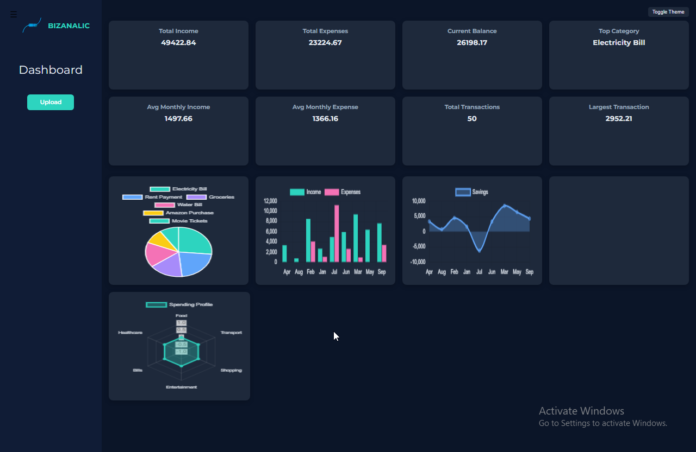
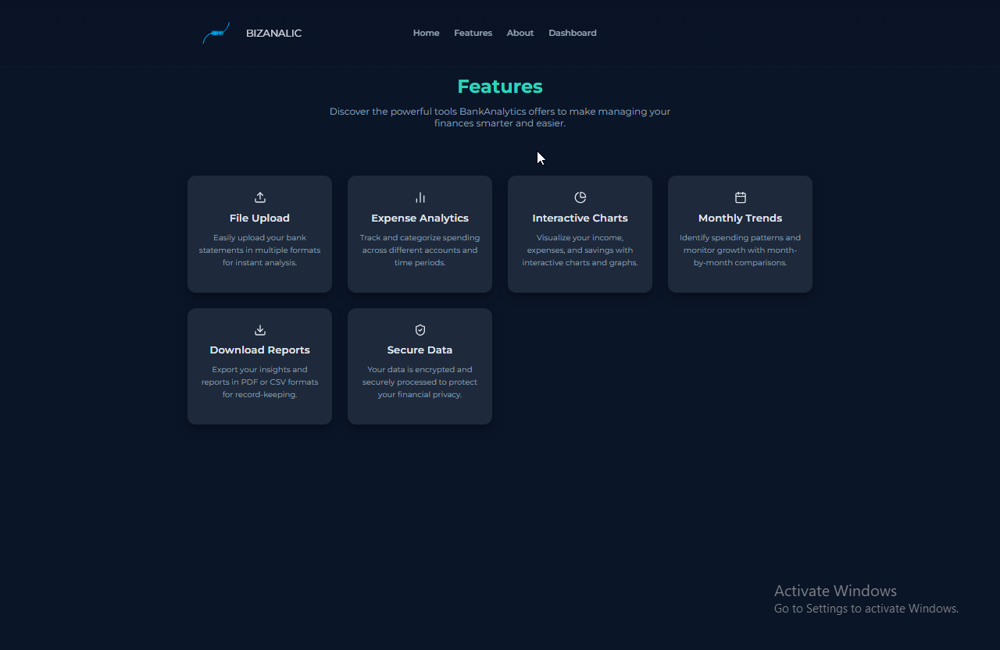
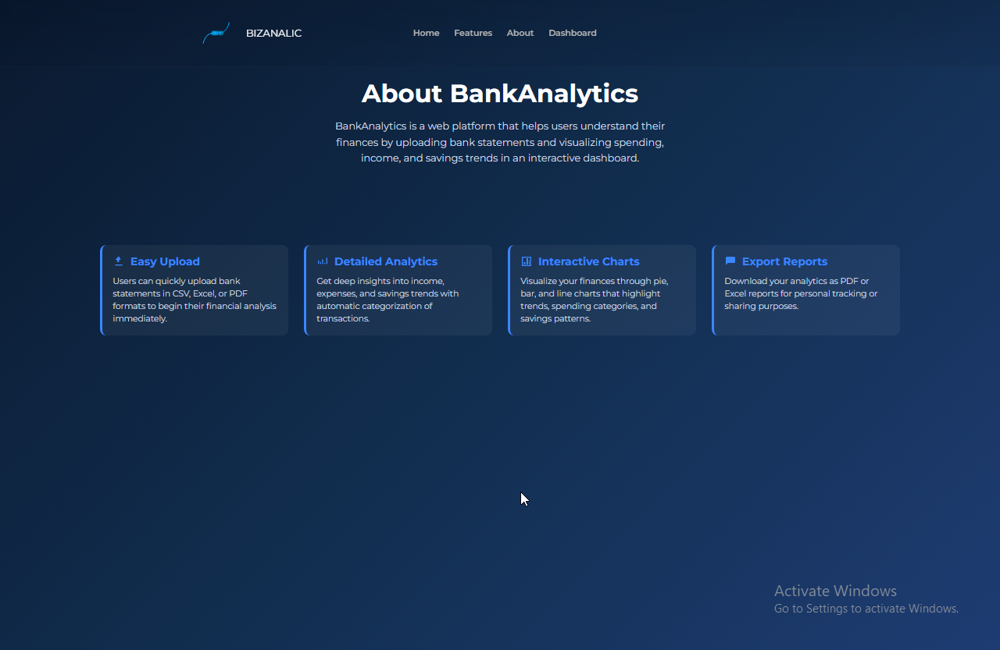

# BizAnalic — Bank Statement Analysis

A Django web application to upload bank statements (CSV, Excel, PDF), extract transactions, and provide interactive analytics with **summary cards** and **charts** on a dashboard.

This repository contains a Django project (`myproject`) and a single app `main`. Front-end templates are in `templates/` and static assets (CSS, JS, images) are in `static/`.

---

## Highlights



- Upload bank statements in **CSV, Excel (.xls/.xlsx), or PDF** formats.  
- PDF parsing via [`pdfplumber`](https://github.com/jsvine/pdfplumber) with regex-based transaction extraction.  
- Data processing with **pandas** and chart data prepared for **Chart.js** in templates.  
- Simple **authentication flow** (signup/login/logout) with session-based data storage for each user.  

---

## Screenshots

**Home Page**  


**Features Page**  


**About Page**


---

## Quick Start (Windows PowerShell)

1. **Create and activate a virtual environment**

```powershell
python -m venv .venv
.\.venv\Scripts\Activate.ps1
